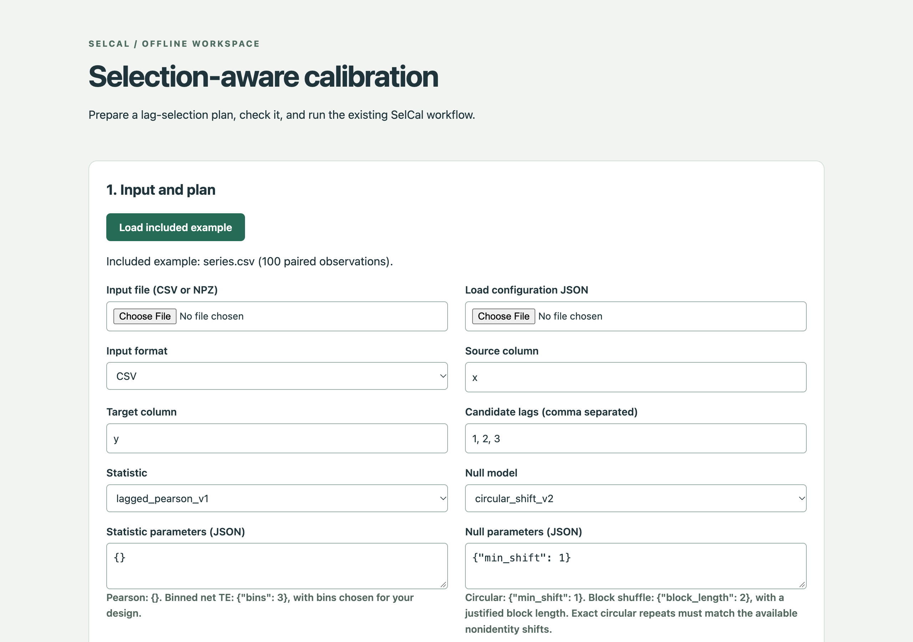
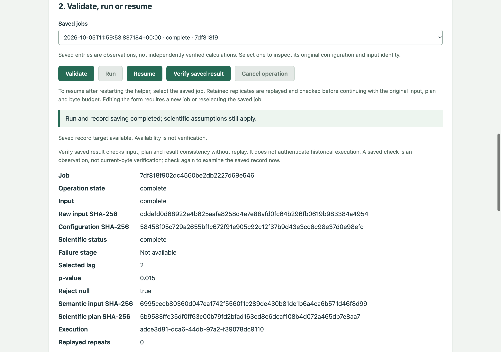
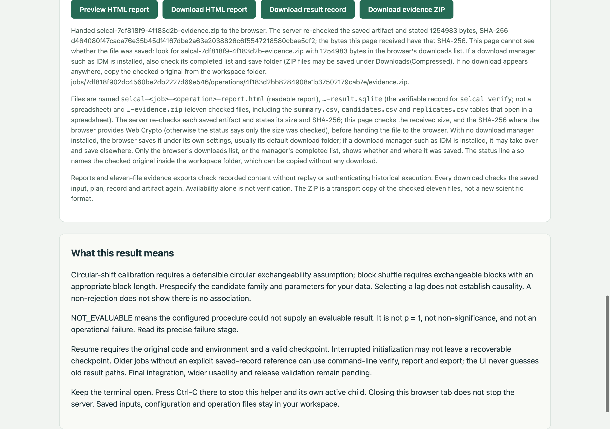

# Using the local interface

`selcal ui` opens a local page that runs the same validate, run, verify, report and export steps
as the command line. It is served on `127.0.0.1` only and needs no network access. The screenshots
below show the bundled example (`examples/workflow`: 100 samples, lags 1–3, 199 circular shifts),
taken in Chrome at 1280 × 900.

```console
selcal ui --workspace my-selcal-workspace
```

Keep the terminal open; it prints the full address including the access token. Press Ctrl-C
there to stop the helper. The workspace folder keeps every input, plan, job and result.

## 1. Input and plan



Choose a CSV or NPZ file and either load a configuration JSON or fill in the form: the source
and target columns, the candidate lags, the statistic and the null model. **Load included
example** fills every field with the example plan. Selecting only an input file keeps the plan
fields as they are, so check them before running.

## 2. Validate, run and read the result



**Validate** checks the plan and reports whether it can reach the chosen alpha (see
[Why was my plan refused?](interpreting_results.md#why-was-my-plan-refused)). **Run** computes
the calibrated result and saves it as a record. The result table shows the selected lag, the
p-value and the decision, together with the hashes that identify the input and the plan. For the
example, lag 2 is selected and p = 3/200 = 0.015, so the null is rejected at alpha = 0.05.
**Resume** continues an interrupted job with its original input and plan; **Verify saved result**
re-checks the saved record.

## 3. Reports, evidence and interpretation



The buttons save the readable HTML report, the SQLite result record (for `selcal verify`) and an
evidence ZIP with eleven files, including `summary.csv`, `candidates.csv` and `replicates.csv`
for a spreadsheet. Before handing each file to the browser, the page checks its size and SHA-256
and then names the file, its size and its checked original in the workspace. If the browser or a
download manager does not save the file, copy that original from the workspace folder.

The **What this result means** panel states the assumptions behind the result. The longer
explanation is in [Interpreting SelCal results](interpreting_results.md).
